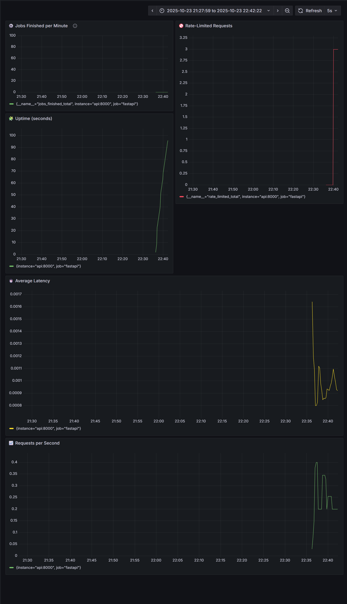

# 📊 API Health Dashboard — *"Because blind debugging is overrated."* 🚦




---

## 🧠 Overview

An interactive **API Health Monitoring Dashboard** built with **FastAPI**, **Prometheus**, **Grafana**, and **Redis RQ**.

Monitor:
- API request rate ⚡
- Latency and uptime ⏱️
- Rate-limited users 🚫
- Background job completions 🎯
- Retry and resilience metrics 💪

All visualized live in Grafana — no more guessing why your system feels slow.

---

## 🧰 Tech Stack

| Layer | Tool | Purpose |
|:------|:------|:--------|
| 🐍 **Backend** | FastAPI | Handles endpoints and metrics |
| 📈 **Metrics** | Prometheus | Collects and stores performance data |
| 🎨 **Visualization** | Grafana | Turns numbers into dashboards and alerts |
| 💾 **Queue** | Redis + RQ | Manages background jobs with retries |
| 🧩 **Alerting** | Prometheus + Grafana | Automated alerts via email |

---

## 🧩 System Flow

```
[ Client ]
   │
   ▼
[ FastAPI (8000) ]
   │  ├─→ /metrics → Prometheus (9090)
   │  └─→ Background Jobs → Redis (6379)
   │
   ▼
[ Worker (RQ) ] — crunches background jobs
   │
   ▼
[ Grafana (3030) ] ← Prometheus Data → Visual Dashboard
```

---

## 🚀 Getting Started

### 1️⃣ Clone & Build

```bash
git clone https://github.com/yourusername/api_health_dashboard.git
cd api_health_dashboard
docker compose up --build
```

### 2️⃣ Access Services

| Service | URL |
|:---------|:----|
| FastAPI | [http://localhost:8000](http://localhost:8000) |
| Prometheus | [http://localhost:9090](http://localhost:9090) |
| Grafana | [http://localhost:3030](http://localhost:3030) |

Default Grafana login:  
**User:** `admin` | **Password:** `admin`

---

## 🧠 Core Features

### ⚙️ Retry Decorator

Generic retry logic for unstable operations with exponential backoff.

```python
@retry(max_retries=3, delay=1, backoff=2)
def call_external_service():
    if random.random() < 0.6:
        raise Exception("API call failed")
    return {"result": "success"}
```

Endpoint:  
`GET /retry-demo` → Simulates API retry behavior.

---

### 🧮 Background Jobs (Redis RQ)

```python
@app.get("/process-job/{n}")
def process_job(n: int):
    job = queue.enqueue(heavy_computation, n)
    return {"job_id": job.id, "status": "queued"}
```

Worker automatically tracks completion metrics via `/internal/job-finished`.

---

### 🔁 Resilience Metrics

Prometheus counters:
- `retry_attempts_total` — number of retry attempts
- `retry_success_total` — successful retries after failures
- `job_finished_total` — completed background jobs

Grafana Panels:

| Panel | Query | Description |
|:------|:------|:-------------|
| 🧮 Total Jobs Finished | `job_finished_total` | Shows cumulative jobs completed |
| ⚙️ Jobs Per Minute | `rate(job_finished_total[10m])` | Job completion rate over time |
| 💪 Recovery Rate | `rate(retry_success_total[5m]) / rate(retry_attempts_total[5m])` | Retry success ratio |

---

### 🚨 Alerts

Prometheus rules (`alert_rules.yml`):

```yaml
- alert: HighRequestLatency
  expr: rate(http_request_duration_seconds_sum[1m]) / rate(http_request_duration_seconds_count[1m]) > 1
  for: 30s
  labels:
    severity: warning
  annotations:
    summary: "High API latency (>1s avg)"
    description: "The average request latency exceeded 1s for 30s."

- alert: TooManyRateLimitedRequests
  expr: increase(rate_limited_total[1m]) > 5
  for: 1m
  labels:
    severity: warning
  annotations:
    summary: "Rate limit threshold exceeded"
    description: "More than 5 rate-limited requests per minute."

- alert: JobNotFinishing
  expr: rate(job_finished_total[5m]) == 0
  for: 10m
  labels:
    severity: warning
  annotations:
    summary: "No background jobs finished recently"
    description: "Check worker container health."
```

---

## 📊 Dashboards

Grafana visualizes:
- Request Rate & Latency
- Rate-limited users
- Job completion trend
- Retry & recovery ratio

You can import the provided JSON dashboard or create custom panels using the queries above.

---

## 🧩 Project Structure

```
app/
├── main.py
├── config.py
├── metrics.py
├── middleware.py
├── routes/
│   ├── jobs.py
│   ├── simulate.py
│   └── system.py
├── workers/
│   ├── tasks.py
│   └── queue.py
└── utils/
    └── retry.py
```

---

## 🧠 Developer Vibes

This project is:
- 80% building
- 15% fixing Docker issues
- 5% pretending you totally planned that dashboard theme 😎

---

## 🧾 License

MIT License © 2025 — Aadarsh  
Pull requests welcome!
